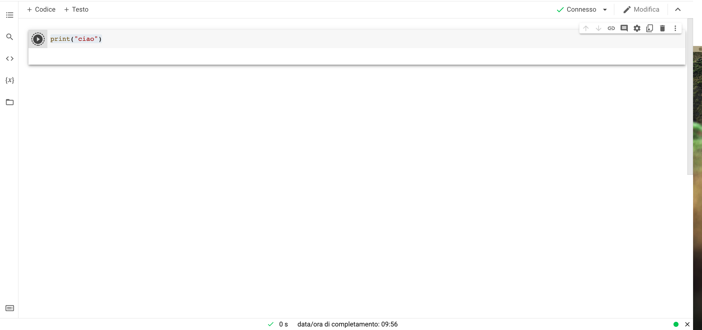
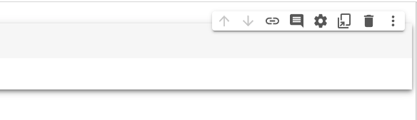
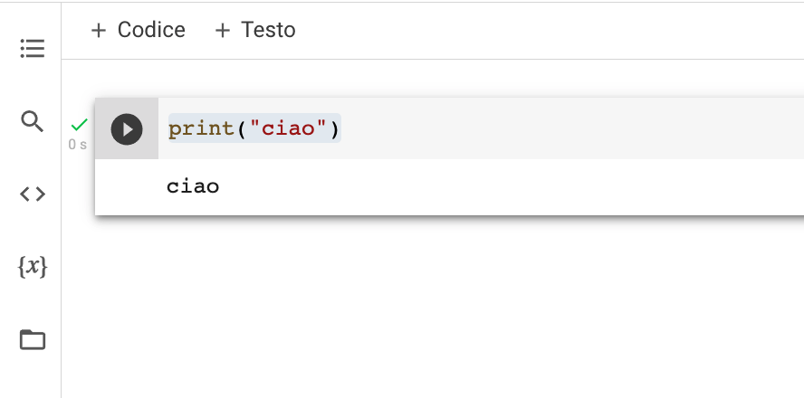
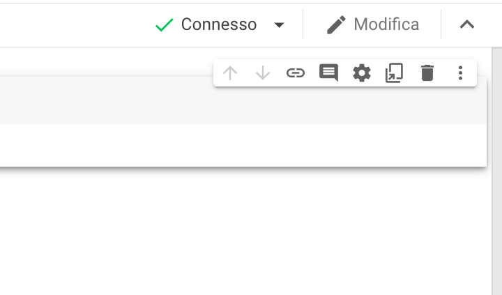
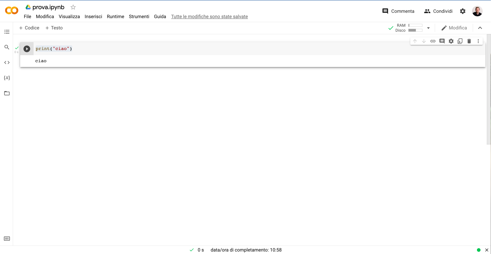

# 00-setup

## Obiettivo
Prendere confidenza con gli strumenti del mestiere. Questo è un passaggio fondamentale per la buona riuscita del proprio progetto: a strumenti potenti ed efficaci corrispondono una più celere gestione del proprio tempo e quindi un lavoro migliore e meno stressante

Nel nostro caso, oggi utilizzeremo uno strumento online di Google, ovvero Google Colaboratory, un editor di testo per codice python (quello usato dalle reti neurali) molto comodo adatto a tutti i sistemi operativi (es. Windows, MacOS, Linux).

Poi faremo uso di:

- Python, il linguaggio di programmazione alla base di tantissimi applicativi, tra cui intelligenze artificiali e reti neurali


## Step:

1. Accedi con il tuo account Google a Google Colaboratory: [https://colab.research.google.com/](https://colab.research.google.com/) - se non hai un account Google, creane uno.
2. Nella schermata che compare, clicca sul pulsante blu in basso a destra nel pannello `Crea nuovo blocco note`
3. Rinomina il file in *"cani-e-gatti.ipynb"* (o un nome che desideri dare al file)
4. Dal menu in alto clicca `Runtime > Cambia tipo di Runtime > Accelleratore Hardware (menu a tendina) > GPU` - in questo modo, rendiamo il nostro blocco note capace di eseguire ancora più calcoli

## Crea delle prime funzioni di prova

Nella schermata del block notes puoi vedere un box con un pulsante `play` accanto: questo è un blocco di codice. Qui inseriremo i vari pezzi di codice con cui far funzionare l'intelligenza artificiale. 
Per farli partire e provarli, basta schiacciare il pulsante play.



Per ora, elimina quello di default. Per farlo, vai sopra al box con il mouse - a destra compariranno delle icone piccole. Clicca quella del cestino.



Ora, per aggiungere un nuovo box di codice da zero, clicca `+Codice` 



Nel box, incolla questo comando:

```
print("ciao")
```

Poi premi il pulsante `Play`. Il sistema si avvierà e caricherà tutti gli elementi necessari. Una volta pronto, eseguirà la funzione e il risultato apparirà sotto al box di codice. Puoi vedere l'avanzamento in alto a destra, accanto al pulsante modifica - in questo caso, il sistema ci dice che è `Connesso`.



Dovresti vedere ora uno spazio bianco sotto con scritto `ciao`



Hai appena coperto tutte le funzionalità principali del blocco note di Google Colab che andremo a usare per la tua prima intelligenza artificiale! 🤩

Puoi procedere con il prossimo step!
| Capitolo successivo                                                                           |
| ---------------------------------------------------------------------------------------------------: |
[01-classificatore-come-funziona ▶︎](../01-classificatore-come-funziona) |
