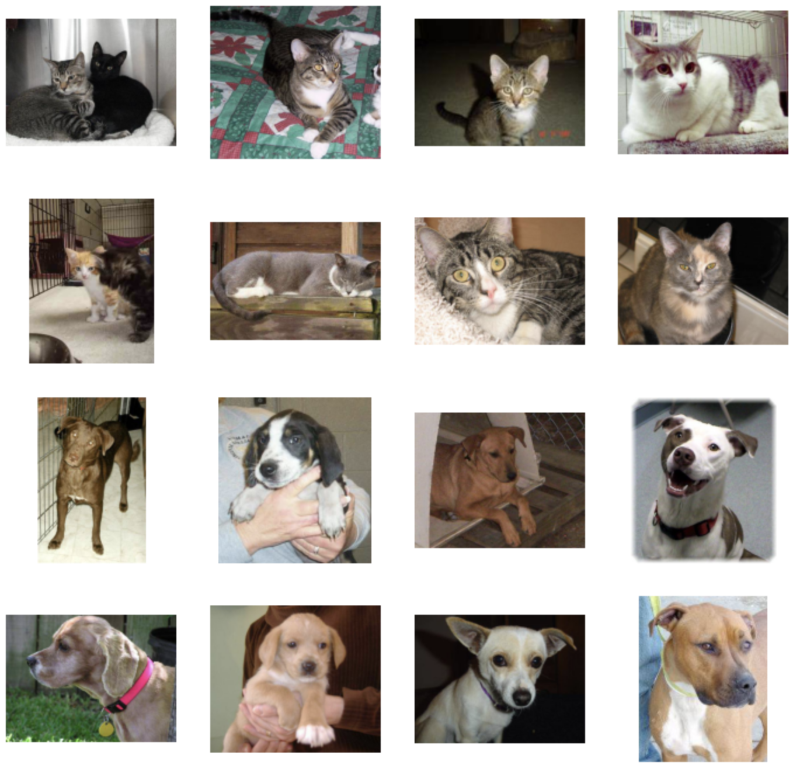

# 02-dataset-immagini

| Capitolo precedente                                                                                                                                          | Capitolo successivo                                                                           |
| :--------------------------------------------------------------------------------------------------------------------------------------------------------------- | ---------------------------------------------------------------------------------------------------: |
| [◀︎ 01-classificatore-come-funziona](../01-classificatore-come-funziona)  | [03-crea-rete ▶︎](../03-crea-rete) |

## Obiettivo

Crea un dataset di immagini su cui addestrare la rete neurale.

Stiamo provando a generare una rete neurale in grado di distinguere tra immagini di gattini e immagini di cagnolini. Affinché la rete ***impari*** la differenza tra le due categorie, dobbiamo raccogliere un bel numero di immagini di gattini e cagnolini da poter dare in pasto alla rete. Più una rete è complessa, più avrà bisogno di un gran numero di dati (immagini in questo caso).

Non è finita qui, ogni immagine avrà bisogno di una corrispondente "etichetta" che indichi la categoria dell'immagine (ovvero se contiene gattini oppure cagnolini). Questa è la parte più faticosa del creare nuovi dataset: le etichette devono essere corrette al 100% (in caso contrario, una rete non imparerebbe nulla!). Per questo, solitamente le etichette non vengono generate in modo automatico da un software, ma da un essere umano che le verifica una per una...

Per fortuna che sul web è disponibile una gran quantità di dataset già pronti! Adesso ne andiamo a scaricare uno.

## Steps

#### 1. Download

Su Google Colab, crea una nuova cella di codice e inserisci il seguente comando per scaricare lo zip contenente il dataset. In un notebook python, le istruzioni che iniziano per `!` vengono interpretate come comandi da eseguire su terminale.

```
!wget --no-check-certificate \
    https://storage.googleapis.com/mledu-datasets/cats_and_dogs_filtered.zip \
    -O /tmp/cats_and_dogs_filtered.zip
```

#### 2. Estrai le immagini

Estrai il contenuto del file .zip appena scaricato, con il seguente codice.

```py
import zipfile		# modulo di python per estrarre file zip

local_zip = '/tmp/cats_and_dogs_filtered.zip'
zip_ref = zipfile.ZipFile(local_zip, 'r')
zip_ref.extractall('/tmp')
zip_ref.close()
```

#### 3. Separa il dataset

Solitamente, i dataset si organizzano in due parti: una parte chiamata *training set* e una chiamata *validation set* (o anche *test set*).
Durante la fase di addestramento (=training), mostreremo alla rete la maggiorparte delle immagini, ma non tutte. Terremo da parte un piccolo numero di immagini da usare come test, per verificare quanto la rete abbia imparato.

Esempio: se nel dataset abbiamo 100 immagini diverse di labrador, durante l'addestramento mostriamo alla rete solo 80 di queste. Al termine dell'addestramento, la rete non ha mai visto le rimanenti 20 immagini. Se la rete è in grado di riconoscere correttamente che queste sono anch'esse immagini di cagnolini, avremo la prova che la rete ha imparato a riconoscere i cani!

Il dataset che abbiamo scaricato, è già comodamente suddiviso in training set e validation set.

- Verifica quante immagini ci sono nelle due parti del dataset con questo codice: 

```py
import os		# modulo di python per interfacciarsi col sistema operativo

base_dir            = '/tmp/cats_and_dogs_filtered'
train_dir           = os.path.join(base_dir, 'train')
validation_dir      = os.path.join(base_dir, 'validation')

train_cats_dir      = os.path.join(train_dir, 'cats')
train_dogs_dir      = os.path.join(train_dir, 'dogs')
validation_cats_dir = os.path.join(validation_dir, 'cats')
validation_dogs_dir = os.path.join(validation_dir, 'dogs')

train_cat_fnames    = os.listdir(train_cats_dir)
train_dog_fnames    = os.listdir(train_dogs_dir)
validation_cat_fnames    = os.listdir(validation_cats_dir)
validation_dog_fnames    = os.listdir(validation_dogs_dir)
train_dog_fnames.sort()

print('Immagini di gattini nel training set:', len(os.listdir(train_cats_dir)))
print('Immagini di cagnolini nel training set:', len(os.listdir(train_dogs_dir)))
print('Immagini di gattini nel validation set:', len(os.listdir(validation_cats_dir)))
print('Immagini di cagnolini nel validation set:', len(os.listdir(validation_dogs_dir)))
```

Dovresti avere in totale 1500 immagini di gattini 🐱 e 1500 immagini di cagnolini 🐶 .

#### 4. Dai un'ultima sistemata al dataset

Prima di essere dato in pasto alla rete, può essere comodo utilizzare un ***generatore*** per leggere automaticamente durante l'addestramento tutte le immagini del dataset. Il generatore è utile anche per rendere le immagini tutte della stessa dimensione e per normalizzare i valori dei pixel (ovvero spostare i valori dal range [0-255] al range [0-1]), cosa che semplifica la vita alla rete.

- Crea due generatori (uno per training, uno per validation), e ridimensiona le immagini a 150x150 pixel:

```py
from tensorflow.keras.preprocessing.image import ImageDataGenerator

train_datagen = ImageDataGenerator(rescale=1./255)
val_datagen   = ImageDataGenerator(rescale=1./255)

train_generator = train_datagen.flow_from_directory(
        train_dir,
        target_size=(150, 150),
        batch_size=20,
        class_mode='binary')

validation_generator = val_datagen.flow_from_directory(
        validation_dir,
        target_size=(150, 150),
        batch_size=20,
        class_mode='binary')
```

#### 5. Visualizza le immagini

Adesso che il dataset è pronto, siamo curiose di scoprire che immagini contiene! Per visualizzare le immagini, usiamo il modulo di python chiamato `matplotlib`, molto usato anche per generare grafici e quant'altro. Con il codice seguente, visualizziamo una griglia di 4x4 immagini del training set, dove le prime due righe contengono gattini e le ultime due cagnolini.

- Per estrarre immagini diverse dal dataset, cambia il valore della variabile `index`, in un range tra 0 e 992:

```py
%matplotlib inline
import matplotlib.pyplot as plt
import matplotlib.image as mpimg

index = 0   # <=== cambia questo numero per vedere immagini diverse (tra 0 e 992)

ncols = 4
nrows = 4
fig = plt.gcf()
fig.set_size_inches( ncols*4, nrows*4 )

cats  = [ os.path.join( train_cats_dir, f ) for f in train_cat_fnames[ index : index+8 ] ]
dogs  = [ os.path.join( train_dogs_dir, f ) for f in train_dog_fnames[ index : index+8 ] ]

for i, img_path in enumerate( cats + dogs ):
  sp  = plt.subplot( nrows, ncols, i+1 )
  sp.axis( 'Off' )
  img = mpimg.imread( img_path )
  plt.imshow( img )

plt.show()
```

Otterrai un risultato simile a questo:
 
<kbd></kbd>

| Capitolo precedente                                                                                                                                          | Capitolo successivo                                                                           |
| :--------------------------------------------------------------------------------------------------------------------------------------------------------------- | ---------------------------------------------------------------------------------------------------: |
| [◀︎ 01-classificatore-come-funziona](../01-classificatore-come-funziona)  | [03-crea-rete ▶︎](../03-crea-rete) |