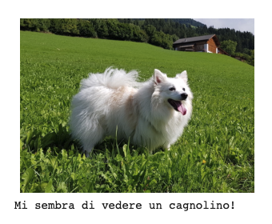

# 05-cosa-ha-imparato

| Capitolo precedente                                                                                                                                          | Capitolo successivo                                                                           |
| :--------------------------------------------------------------------------------------------------------------------------------------------------------------- | ---------------------------------------------------------------------------------------------------: |
| [◀︎ 04-addestra-rete ](../04-addestra-rete )  | [reti-potenziate/object-detector ▶︎](../reti-potenziate/object-detector) |

## Obiettivo

Verificare se la rete ha imparato a distinguere tra cani e gatti.

Terminato l'addestramento, i neuroni della rete avranno "assimilato" in qualche modo l'idea di che aspetto ha un gatto e un cane, e di quali siano le differenze visive tra le due categorie.

Adesso possiamo usare la rete per analizzare nuove immagini e farci dire a quale categoria appartengono (🐶/🐱).


## Steps

### 1. Crea una funzione di test

Per comodità creiamoci una funzione che ci permetta di testare la risposta della rete su una immagine del nostro dataset. Questa funzione:

- visualizza l'immagine che dai alla rete,
- da in pasto l'immagine alla rete neurale,
- stampa la risposta.

Copia i comandi in un **nuovo blocco di codice**

```py
import numpy as np				# modulo python per gestire strutture numeriche
from PIL import Image			# modulo python per gestire immagini

def test_model( fname ):
  # visualizza l'immagine
  fname = mpimg.imread( fname )
  plt.axis( 'off' )
  _     = plt.imshow( fname )
  plt.show()
  img   = Image.fromarray( fname ).resize( ( 150, 150 ) )
  img   = np.array( img )

  # calcola il risultato della rete
  res   = model.predict( np.expand_dims( img, axis=0 ) )
  res   = res[ 0 ][ 0 ]
  
  # numero vicino a zero = gatto, numero vicino a 1 = cane
  if res < 0.5:
    print( "Mi sembra di vedere un gattino!\n\n" )
  else:
    print( "Mi sembra di vedere un cagnolino!\n\n" )

```

### 2. Metti alla prova la rete

Usa la funzione `test_model` appena creata per mettere alla prova la rete.

- Pesca una immagine di gattini e una di cagnolini dal dataset:

> Per pescare immagini diverse, cambia i due numeri (puoi scegliere numeri compresi tra 0 e 499)

```py
cat   = os.path.join( validation_cats_dir, validation_cat_fnames[ 7 ] )     # <=== prova numeri diversi
dog   = os.path.join( validation_dogs_dir, validation_dog_fnames[ 420 ] )
```

- Testa la rete sulle immagini:

```py
test_model( dog )
test_model( cat )
```

In questo modo puoi verificare se la rete ha imparato bene la differenza tra 🐶/🐱. Noterai che a volte sbaglia, tende a classificare i gatti come cagnolini, ma nella maggiorparte dei casi ci prende. È un ottimo risultato per una rete addestrata in meno di un minuto!!

<kbd></kbd>
 

### 3. Usa le immagini che vuoi tu

Non limitarti alle immagini prese dal dataset! Puoi passare alla rete qualsiase immagine tu voglia. Proviamo ad esempio ad usare una foto della mia cagnolina Minou 💚

<kbd></kbd>

- Scarica questa immagine (o scegline una a piacimento).
- Dentro Colab, clicca sull'icona della cartella che si trova nella barra a sinistra.

<kbd></kbd>


- Trascina il file dell'immagine all'interno dell'area, oppure clicca sull'icona per fare l'upload del file.

<kbd></kbd>

- Adesso trovi il tuo file sulla cartella virtuale dove stai lavorando.

<kbd></kbd>

- Esegui la rete sulla tua immagine e guarda il risultato!

```py
test_model( "minou.jpg" )
```

<kbd></kbd>


### 4. Complimenti! 🏆

Hai ufficialmente generato la tua prima rete neurale artificiale!! Hai avuto un vero assaggio del mondo dell'intelligenza artificale. Benvenuta nel club di chi lavora in ambito machine learning:

<kbd></kbd>


| Capitolo precedente                                                                                                                                          | Capitolo successivo                                                                           |
| :--------------------------------------------------------------------------------------------------------------------------------------------------------------- | ---------------------------------------------------------------------------------------------------: |
| [◀︎ 04-addestra-rete ](../04-addestra-rete )  | [reti-potenziate ▶︎](../reti-potenziate/) | 