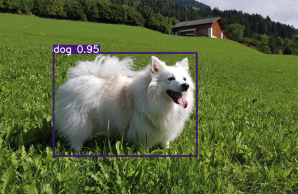
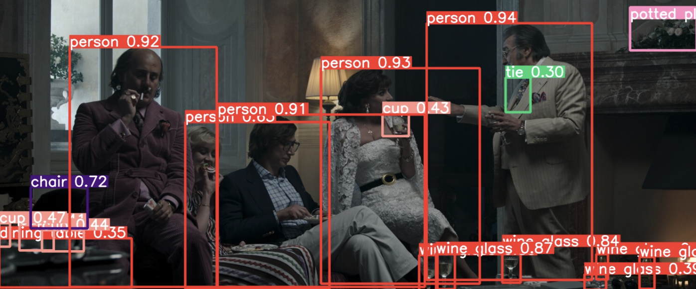

# object-detector

| Capitolo precedente                                                                                                                                          | Capitolo successivo                                                                           |
| :--------------------------------------------------------------------------------------------------------------------------------------------------------------- | ---------------------------------------------------------------------------------------------------: |
| [◀︎ 05-cosa-ha-imparato ](../../05-cosa-ha-imparato )  | [reti-potenziate/style-transfer ▶︎](../style-transfer) |

## Obiettivo

Sperimenta cosa possono fare le reti con applicazioni più elaborate.

L'esempio che abbiamo svolto (🐶/🐱) rappresenta un'applicazione piuttosto semplice. Naturalmente, le reti possono apprendere compiti molto più complessi. Come abbiamo visto, reti molto elaborate richiedono lunghi tempi di addestramento. 

Per questo motive, andremo ad usare delle reti già pronte ed addestrate, che si possono trovare online. Dato che l'addestramento è già stato fatto, non abbiamo nemmeno bisogno di scaricare un dataset.

In questo primo esempio, usiamo la rete chiamata **YOLO**. Si tratta di un *object detector*, ovvero una rete che, data un'immagine o un video, individua gli oggetti presenti e traccia una cornice rettangolare (=bounding box) intorno ad essi. YOLO è addestrata per individuare oggetti di 80 classi diverse.


## Steps

### 1. Scarica la rete

La rete neurale si trova in un repository su GitHub. Useremo la versione n.3 di YOLO.

- In un nuovo notebook di Colab, crea una cella di codice ed esegui questo codice per scaricare la rete ed installare i pacchetti necessari:

```py
!git clone https://github.com/ultralytics/yolov3
%cd yolov3
%pip install -qr requirements.txt
```

- Importa i moduli python che ci serviranno:

```py
import torch
import io
import os
from yolov3 import utils
from IPython.display import HTML
from base64 import b64encode
display = utils.notebook_init()  # checks
%cd /content/
```

### 2. Crea una funzioni per YOLO

- Crea una funzione per chiamare YOLO passando direttamente una immagine o un video a piacimento:

```py
def object_detect( nome_file, nome_cartella ):
  !python yolov3/detect.py --weights yolov3/yolov3.pt --source {nome_file} --project {nome_cartella} --name . --exist-ok
```

### 3. Testa la rete su immagini

Usiamo nuovamente la foto di Minou come primo test.

- Come fatto prima, carica il file della immagine nel workspace virtuale del tuo notebook.
- Esegui il comando:

```py
object_detect( "minou.jpg", "result" )
display.Image( filename="result/minou.jpg", width=600 )
```

Il risultato è l'immagine di partenza con aggiunto un riquadro attorno a Minou. Il riquadro riporta il nome della classe a cui appartiente l'oggetto individuato (dog), e un valore numerico tra 0 e 1. Questo valore rappresenta la ***confidenza*** con cui la rete è sicura del suo risultato. Più il numero è alto, più la rete è certa di aver risposto correttamente.

<kbd></kbd>

Proviamo con una immagine con più elementi. L'immagine seguente è presa dal trailer del nuovo film *House of Gucci:*

<kbd></kbd>

- Come sopra, carica il file su Colab.
- Esegui il comando:

```py
object_detect( "gucci.jpg", "result" )
display.Image( filename="result/gucci.jpg", width=1400 )
```

Stavolta la rete ha individuato molti più oggetti nell'immagine! Possiamo vedere che su alcuni oggetti la rete non è sicurissima della sua decisione (esempio la cravatta di Al Pacino ha una confidenza di solo 0.3, ma è comunque stata classificata correttamente).

<kbd></kbd>


### 3. Testa la rete su video

Proviamo cosa succede se a YOLO diamo in pasto un video! Come esempio, ho preso una clip sempre dal trailer di *House of Gucci*. Trovi il file da scaricare nella cartella `assets` di questa repository.

<kbd></kbd>

> Se vuoi provare con un tuo video, attenzione a non caricare file troppo grandi, altrimenti dovrai aspettare un bel po' per ottenere il risultato! Considera che un video di 3MB richiede un paio di minuti di calcolo.

- Carica il file video (`.mp4`) su Colab.
- Esegui il comando seguente per ottenere il video di risultato:

```py
# potrebbe richiedere qualche minuto
object_detect( "gucci.mp4", "result" )
```

Vedrai come la rete stamperà ad ogni frame del video che classi di oggetti individua.

Prima di visualizzare il risultato, è necessario convertire il file da `.mp4` a `.webm`:

```py
# potrebbe richiedere qualche minuto
!ffmpeg -i 'result/gucci.mp4' -vcodec vp9 result/gucci.webm
```

- Infine, vediamo il risultato!

```py
with  io.open('result/gucci.webm','r+b') as f:
    mp4 = f.read()
data_url = "data:video/webm;base64," + b64encode(mp4).decode()
HTML("""<video width=800 controls><source src="%s" type="video/webm"></video>""" % data_url)
```

Come vedi, i riquadri attorno agli oggetti seguono i movimenti del loro contenuto, niente male!

<kbd></kbd>

Adesso divertiti a provare tu con altri video o immagini ✨

| Capitolo precedente                                                                                                                                          | Capitolo successivo                                                                           |
| :--------------------------------------------------------------------------------------------------------------------------------------------------------------- | ---------------------------------------------------------------------------------------------------: |
| [◀︎ reti-potenziate ](..)  | [reti-potenziate/style-transfer ▶︎](../style-transfer) |