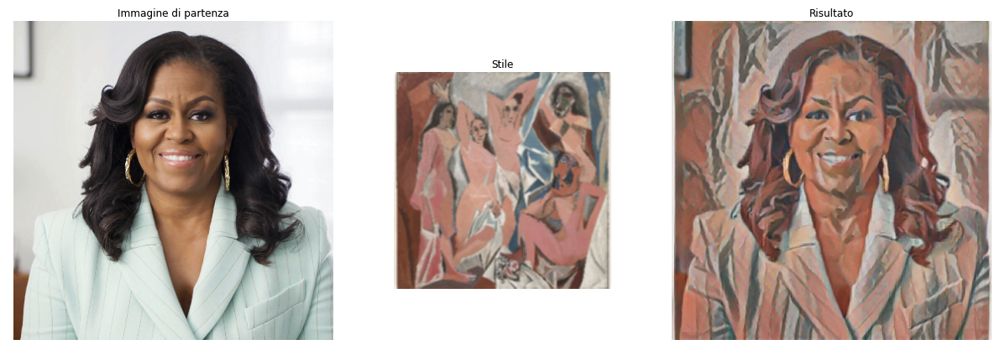
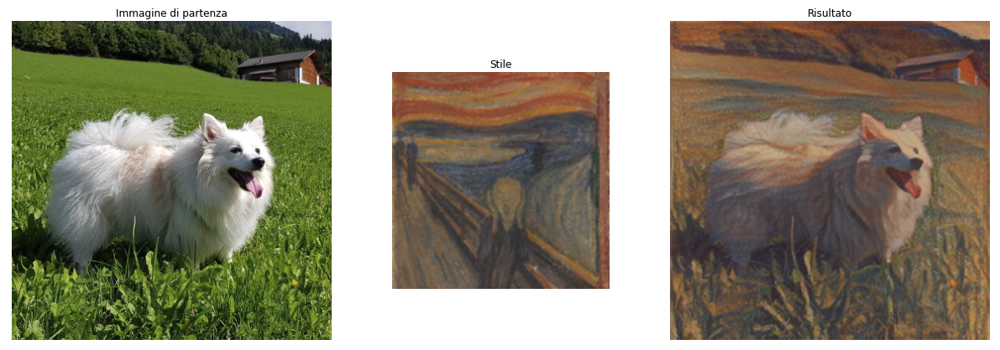

# style-transfer

| Capitolo precedente                                                                                                                                          | Capitolo successivo                                                                           |
| :--------------------------------------------------------------------------------------------------------------------------------------------------------------- | ---------------------------------------------------------------------------------------------------: |
| [◀︎ reti-potenziate/object-detector ](../object-detector)  | [torna-inizio ▶︎](../../../..) |

## Obiettivo

Sperimenta con una rete per trasferire lo stile da un'immagine ad un'altra.

Usiamo un'altra rete messa a disposizione da Google. Si tratta di una rete per ***style transfer***, ovvero una rete che data un'immagine contenente uno "stile" particolare, estrae lo stile e lo trasferisce ad un'altra immagine totalmente diversa.

La cosa diventa divertente quando l'immagine da cui estraiamo lo stile è un quadro molto caratteristico. Così possiamo trasformare una nostra immagine qualsiasi simile ad una vera opera d'arte! 🖼

## Steps

### 1. Importa i moduli e la rete

- Inizia un **nuovo notebook su Colab**, e importa i moduli python che ci servono:

```py
import os
from matplotlib import gridspec
import matplotlib.pylab as plt
import numpy as np
import tensorflow as tf
import tensorflow_hub as hub
```

- Scarica la rete già pronta:

```py
hub_handle = 'https://tfhub.dev/google/magenta/arbitrary-image-stylization-v1-256/2'
hub_module = hub.load( hub_handle )
```

### 2. Crea funzioni di supporto

- Crea una funzione per ritagliare immagini in forma quadrata:

```py
def crop_center( image ):
  shape = image.shape
  new_shape = min(shape[1], shape[2])
  offset_y = max(shape[1] - shape[2], 0) // 2
  offset_x = max(shape[2] - shape[1], 0) // 2
  image = tf.image.crop_to_bounding_box( image, offset_y, offset_x, new_shape, new_shape)
  return image
```

- Crea una funziona per caricare immagini a piacimento:

```py
def load_image( image_url, image_size=(256, 256), preserve_aspect_ratio=True ):
  if "http" in image_url:
    image_path  = tf.keras.utils.get_file(os.path.basename(image_url)[-128:], image_url)
  else:
    image_path  = image_url
  img = tf.io.decode_image(tf.io.read_file(image_path),channels=3, dtype=tf.float32)[tf.newaxis, ...]
  img = crop_center(img)
  img = tf.image.resize(img, image_size, preserve_aspect_ratio=True)
  return img
```

- Crea una funzione per visualizzare il risultato:

```py
def show_n( images, titles=('',) ):
  n = len(images)
  image_sizes = [image.shape[1] for image in images]
  w = (image_sizes[0] * 6) // 320
  plt.figure(figsize=(w * n, w))
  gs = gridspec.GridSpec(1, n, width_ratios=image_sizes)
  for i in range(n):
    plt.subplot(gs[i])
    plt.imshow(images[i][0], aspect='equal')
    plt.axis('off')
    plt.title(titles[i] if len(titles) > i else '')
  plt.show()
```

### 3. Scegli le immagini

Puoi sia caricare le immagini che vuoi, oppure usare immagini prese online! Qui useremo come esempio di nuovo la foto di Minou 🐶, da caricare su Colab.

- Crea un elenco di immagini da usare come "stile" (prediamo alcuni quadri famosi da wikipedia):

```py
style_urls = dict(
  kanagawa_great_wave         = 'https://upload.wikimedia.org/wikipedia/commons/0/0a/The_Great_Wave_off_Kanagawa.jpg',
  kandinsky_composition_7     = 'https://upload.wikimedia.org/wikipedia/commons/b/b4/Vassily_Kandinsky%2C_1913_-_Composition_7.jpg',
  hubble_pillars_of_creation  = 'https://upload.wikimedia.org/wikipedia/commons/6/68/Pillars_of_creation_2014_HST_WFC3-UVIS_full-res_denoised.jpg',
  van_gogh_starry_night       = 'https://upload.wikimedia.org/wikipedia/commons/thumb/e/ea/Van_Gogh_-_Starry_Night_-_Google_Art_Project.jpg/1024px-Van_Gogh_-_Starry_Night_-_Google_Art_Project.jpg',
  turner_nantes               = 'https://upload.wikimedia.org/wikipedia/commons/b/b7/JMW_Turner_-_Nantes_from_the_Ile_Feydeau.jpg',
  munch_scream                = 'https://upload.wikimedia.org/wikipedia/commons/c/c5/Edvard_Munch%2C_1893%2C_The_Scream%2C_oil%2C_tempera_and_pastel_on_cardboard%2C_91_x_73_cm%2C_National_Gallery_of_Norway.jpg',
  picasso_demoiselles_avignon = 'https://upload.wikimedia.org/wikipedia/en/4/4c/Les_Demoiselles_d%27Avignon.jpg',
  picasso_violin              = 'https://upload.wikimedia.org/wikipedia/en/3/3c/Pablo_Picasso%2C_1911-12%2C_Violon_%28Violin%29%2C_oil_on_canvas%2C_Kr%C3%B6ller-M%C3%BCller_Museum%2C_Otterlo%2C_Netherlands.jpg',
  picasso_bottle_of_rum       = 'https://upload.wikimedia.org/wikipedia/en/7/7f/Pablo_Picasso%2C_1911%2C_Still_Life_with_a_Bottle_of_Rum%2C_oil_on_canvas%2C_61.3_x_50.5_cm%2C_Metropolitan_Museum_of_Art%2C_New_York.jpg',
  fire                        = 'https://upload.wikimedia.org/wikipedia/commons/3/36/Large_bonfire.jpg',
  amadeo_style_life           = 'https://upload.wikimedia.org/wikipedia/commons/8/8e/Untitled_%28Still_life%29_%281913%29_-_Amadeo_Souza-Cardoso_%281887-1918%29_%2817385824283%29.jpg',
  derkovtis_talig             = 'https://upload.wikimedia.org/wikipedia/commons/3/37/Derkovits_Gyula_Talig%C3%A1s_1920.jpg',
  amadeo_cardoso              = 'https://upload.wikimedia.org/wikipedia/commons/7/7d/Amadeo_de_Souza-Cardoso%2C_1915_-_Landscape_with_black_figure.jpg'
)
```

- Crea un elenco di immagini "contenuto" su cui trasferire gli stili (includiamo anche la foto di Minou):

```py
content_urls = dict(
  sea_turtle    = 'https://upload.wikimedia.org/wikipedia/commons/d/d7/Green_Sea_Turtle_grazing_seagrass.jpg',
  tuebingen     = 'https://upload.wikimedia.org/wikipedia/commons/0/00/Tuebingen_Neckarfront.jpg',
  obama         = 'https://nypost.com/wp-content/uploads/sites/2/2021/11/michelle-obama-106.jpg?quality=90&strip=all',
  minou         = 'minou.jpg'
)
```

- Sistema le immagini con le funzioni create prima:

```py
content_image_size  = 384
style_image_size    = 256
content_images      = { k: load_image(v, (content_image_size, content_image_size)) for k, v in content_urls.items() }
style_images        = { k: load_image(v, (style_image_size, style_image_size)) for k, v in style_urls.items() }
style_images        = { k: tf.nn.avg_pool(style_image, ksize=[3,3], strides=[1,1], padding='SAME') for k, style_image in style_images.items() }
```

### 4. Prova la rete!

- Scegli dall'elenco quale immagini usare come "contenuto" e "stile", proviamo con Obama e un quadro di Picasso:

```py
content = 'obama'                       # <=== modifica l'immagine di partenza
style   = 'picasso_demoiselles_avignon' # <=== modifica lo stile
```

- Visualizza il risultato:

```py
c_img   = content_images[ content ]
s_img   = style_images[ style ]
res     = hub_module( tf.constant( c_img ), tf.constant( s_img ) )[ 0 ]
show_n( [ c_img, s_img, res], titles=['Immagine di partenza', 'Stile', 'Risultato'] )
```

<kbd></kbd>

Forte, no? 🤩 Riproviamo con la foto di Minou e un quadro di Munch.

```py
content = 'minou'                       # <=== modifica l'immagine di partenza
style   = 'munch_scream'                # <=== modifica lo stile

c_img   = content_images[ content ]
s_img   = style_images[ style ]
res     = hub_module( tf.constant( c_img ), tf.constant( s_img ) )[ 0 ]
show_n( [ c_img, s_img, res], titles=['Immagine di partenza', 'Stile', 'Risultato'] )
```

<kbd></kbd>

Divertiti a provare le combinazioni più belle! ✨

| Capitolo precedente                                                                                                                                          | Capitolo successivo                                                                           |
| :--------------------------------------------------------------------------------------------------------------------------------------------------------------- | ---------------------------------------------------------------------------------------------------: |
| [◀︎ reti-potenziate/object-detector ](../object-detector)  | [torna-inizio ▶︎](../../../..) |